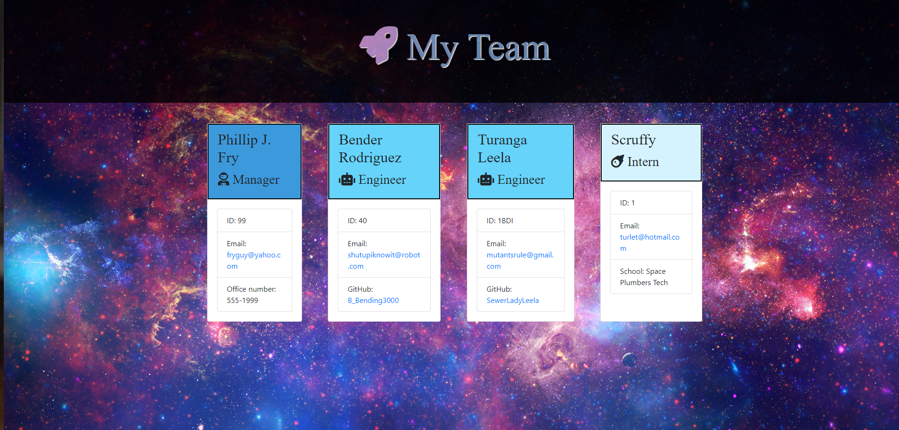
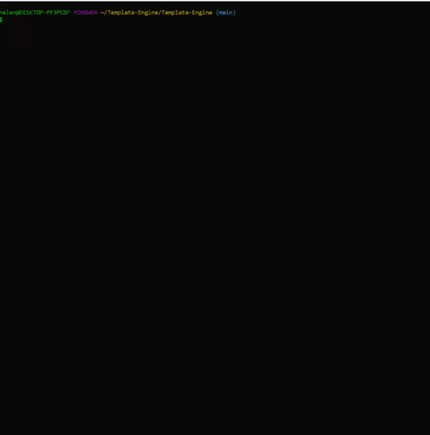

# Template-Engine

---

## User Story:

"As a manager
I want to generate a webpage that displays my team's basic info
so that I have quick access to emails and GitHub profiles"

## Description

Build a Node CLI that takes in employee information and generates an HTML webpage that displays summaries for each person. The user is guided through a series of specific prompts based on employee type which are then pushed onto individual cards. The application must pass all tests run. 

---
## Table of Contents

* [Installation](#installation)
* [Languages/Dependencies/Resources](#languages/dependencies/resources)
* [Usage](#usage)
* [Testing](#testing)
* [Questions/Contact](#questions/contact)
* [Badges](#badges)

## Installation

run npm i

## Languages/Dependencies/Resources

* Javascript 
* HTML
* CSS
* Node.js
* Inquirer 
* Jest
* Chalk
* Fontawesome
* Bootstrap
* Google Fonts

## Usage 

run node app.js

<h2>Command line application in action:</h2>

<h2>Screenshot of rendered HTML employee page:</h2>

## Testing

## Questions/Contact

For additional information contact me at: 

GitHub: [@HelenIL](https://github.com/HelenIL/)

Email: [helenilindberg@yahoo.com](mailto:helenilindberg@yahoo.com)

## Badges

